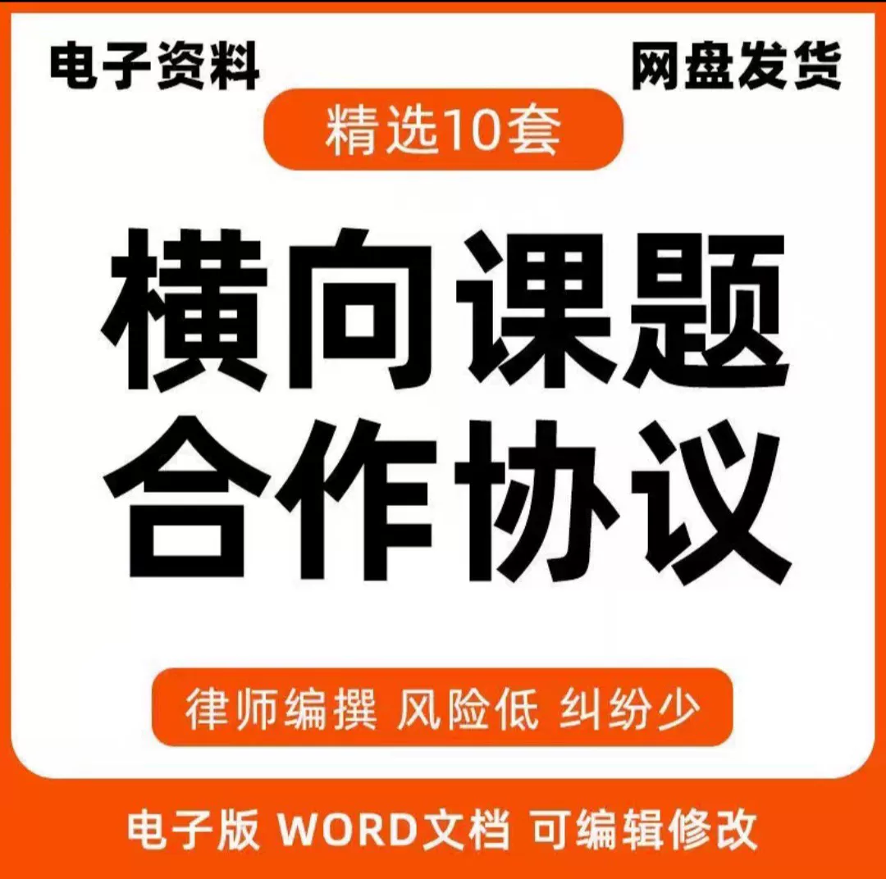
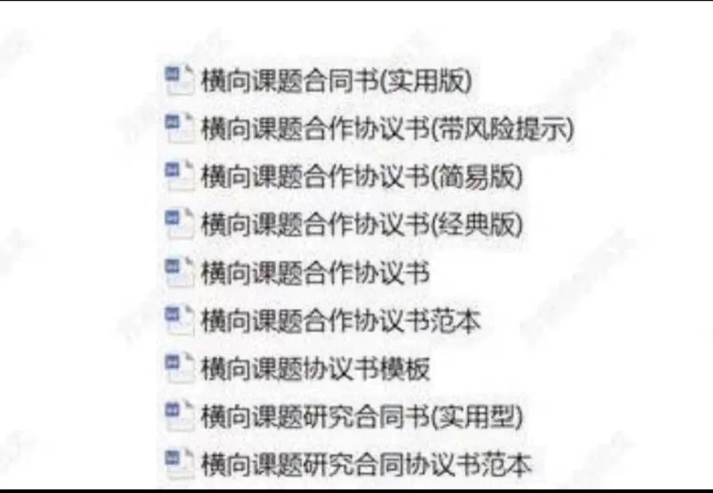
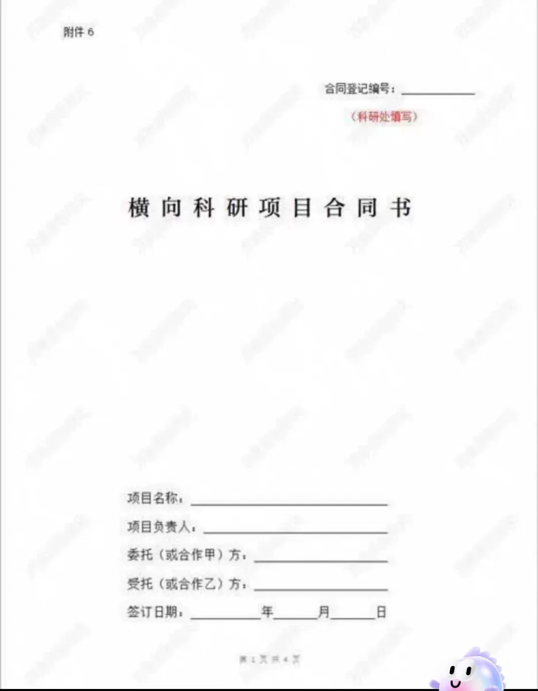
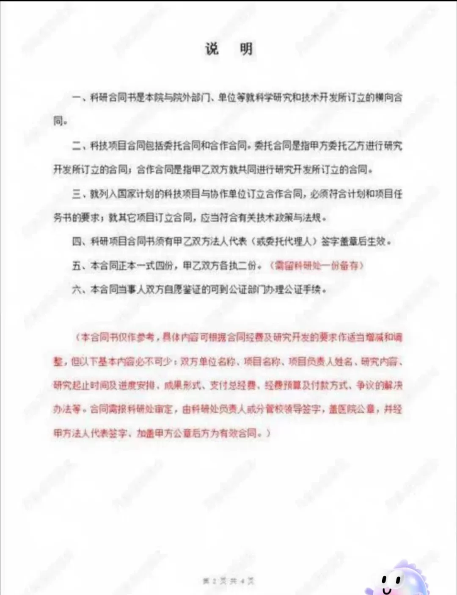
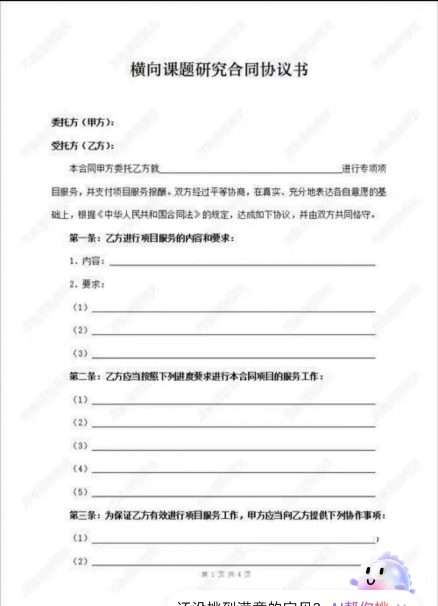
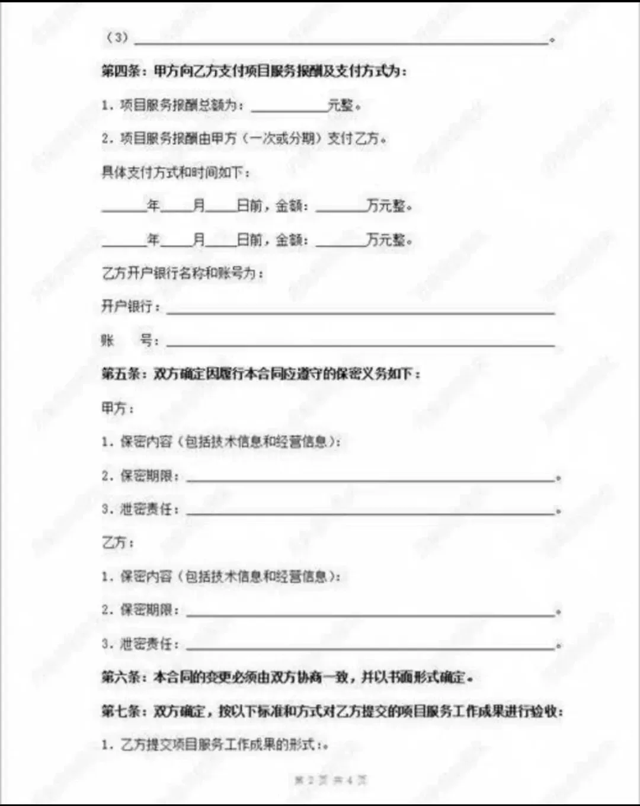

# 【B374 Seconds Shipment】Horizontal Topic Research Cooperation Agreement Electronic

## Body

# B374 Seconds Shipment Contract for Horizontal Project Research and Cooperation Agreement

## Parties

1. **Party A**: [Name of Party A]
   - Address: [Address of Party A]
   - Telephone: [Telephone Number of Party A]
   - Email: [Email Address of Party A]

2. **Party B**: [Name of Party B]
   - Address: [Address of Party B]
   - Telephone: [Telephone Number of Party B]
   - Email: [Email Address of Party B]

## Introduction

This is a horizontal project research and cooperation agreement between Party A and Party B, which aims to promote the development of [specific industry or field], through joint efforts in research and innovation. The parties agree to cooperate on the following terms and conditions:

## Scope of Cooperation

1. **Research Topic**: [Specific research topic]
2. **Duration**: [Duration of the research project]
3. **Deliverables**: [Expected deliverables and their content]
4. **Methodology**: [Applicable research methods and tools]
5. **Data Collection and Analysis**: [Details of data collection and analysis processes]
6. **Reporting Requirements**: [Format and frequency of report submission]
7. **Confidentiality**: [Definitions of confidential information and its protection measures]
8. **Legal Liability**: [Definitions of liability and responsibilities in case of breach]
9. **Termination Clause**: [Conditions for termination of the contract]

## Cooperation Terms

1. **Payment Method**: [Details of payment method and timing]
2. **Dispute Resolution**: [Procedures for resolving disputes]
3. **Terms of Reference**: [Definitions of reference materials and standards]
4. **Innovation Rights**: [Definitions of rights related to innovation and intellectual property]
5. **Data Security**: [Measures for protecting data security and privacy]
6. **Environmental Considerations**: [Considerations for environmental protection and sustainable development]
7. **Training and Support**: [Details of training and technical support provided by both parties]
8. **Performance Evaluation**: [Metrics for performance evaluation and rewards/penalties]
9. **Termination Conditions**: [Conditions for termination of the contract]

## Payment Terms

1. **Payment Schedule**: [Details of payment schedule and milestone payments]
2. **Payment Limits**: [Maximum amount that can be paid at any time]
3. **Payment Receipts**: [Requirements for receiving payment receipts]
4. **Payment Due Dates**: [Deadlines for making payments]
5. **Payment Adjustments**: [Procedures for adjusting payments due to changes in circumstances]
6. **Payment Disbursements**: [Details of how payments are disbursed]
7. **Refund Policy**: [Policy for refunding unsatisfactory payments]
8. **Payment Transfers**: [Details of transferring funds from one party to another]
9. **Payment Confirmation**: [Requirements for receiving confirmation of payment status]

## Intellectual Property Rights

1. **Ownership**: [Definitions of ownership and rights to use the work produced by the parties]
2. **Patent Rights**: [Definitions of patent rights and obligations related to patent applications]
3. **Trademark Rights**: [Definitions of trademark rights and obligations related to trademark registration]
4. **Copyright Rights**: [Definitions of copyright rights and obligations related to copyright protection]
5. **Other Intellectual Property Rights**: [Definitions of other intellectual property rights and their protection measures]
6. **Confidentiality**: [Definitions of confidential information and its protection measures]
7. **Non-Disclosure Agreement**: [Definitions of non-disclosure obligations and penalties for breach]
8. **Liability for Infringement**: [Definitions of liability for infringement and remedies for infringement claims]
9. **Termination of Intellectual Property Rights**: [Conditions for terminating intellectual property rights]

## Disclaimer of Warranty

1. **Warranty Duration**: [Duration of warranty period]
2. **Warranty Content**: [Content of warranty)
3. **Warranty Limitations**: [Limitations on warranty coverage]
4. **Warranty Claims**: [Procedures for claiming warranty compensation]
5. **Warranty Exclusions**: [Definitions of exclusions from warranty coverage]
6. **Warranty Duration after Termination**: [Duration of warranty after contract termination]
7. **Warranty Modification**: [Procedures for modifying warranties during the contract period]
8. **Warranty Extension**: [Procedures for extending warranty periods]
9. **Warranty Replacement**: [Definitions of warranty replacement and requirements for replacement]
10. **Warranty Duration After Termination**: [Duration of warranty after contract termination]
11. **Warranty Duration After Termination**: [Duration of warranty after contract termination]
12. **Warranty Duration After Termination**: [Duration of warranty after contract termination]
13. **Warranty Duration After Termination**: [Duration of warranty after contract termination]
14. **Warranty Duration After Termination**: [Duration of warranty after contract termination]
15. **Warranty Duration After Termination**: [Duration of warranty after contract termination]
16. **Warranty Duration After Termination**: [Duration of warranty after contract termination]
17. **Warranty Duration After Termination**: [Duration of warranty after contract termination]
18. **Warranty Duration After Termination**: [Duration of warranty after contract termination]
19. **Warranty Duration After Termination**: [Duration of warranty after contract termination]
20. **Warranty Duration After Termination**: [Duration of warranty after contract termination]
21. **Warranty Duration After Termination**: [Duration of warranty after contract termination]
22. **Warranty Duration After Termination**: [Duration of warranty after contract termination]
23. **Warranty Duration After Termination**: [Duration of warranty after contract termination]
24. **Warranty Duration After Termination**: [Duration of warranty after contract termination]
25. **Warranty Duration After Termination**: [Duration of warranty after contract termination]
26. **Warranty Duration After Termination**: [Duration of warranty after contract termination]
27. **Warranty Duration After Termination**: [Duration of warranty after contract termination]
28. **Warranty Duration After Termination**: [Duration of warranty after contract termination]
29. **Warranty Duration After Termination**: [Duration of warranty after contract termination]
30. **Warranty Duration After Termination**: [Duration of warranty after contract termination]
31. **Warranty Duration After Termination**: [Duration of warranty after contract termination]
32. **Warranty Duration After Termination**: [Duration of warranty after contract termination]
33. **Warranty Duration After Termination**: [Duration of warranty after contract termination]
34. **Warranty Duration After Termination**: [Duration of warranty after contract termination]
35. **Warranty Duration After Termination**: [Duration of warranty after contract termination]
36. **Warranty Duration After Termination**: [Duration of warranty after contract termination]
37. **Warranty Duration After Termination**: [Duration of warranty after contract termination]
38. **Warranty Duration After Termination**: [Duration of warranty after contract termination]
39. **Warranty Duration After Termination**: [Duration of warranty after contract termination]
40. **Warranty Duration After Termination**: [Duration of warranty after contract termination]
41. **Warranty Duration After Termination**: [Duration of warranty after contract termination]
42. **Warranty Duration After Termination**: [Duration of warranty after contract termination]
43. **Warranty Duration After Termination**: [Duration of warranty after contract termination]
44. **Warranty Duration After Termination**: [

(Full product description was not available from the source page.)

## Images

## Payment

Here is a pay link on Stripe ( https://buy.stripe.com/3cs8yP7sY87d0vu9AB ). Please contact me lonlonago@foxmail.com after funding $89, and I will send you a complete data files , thank you!

